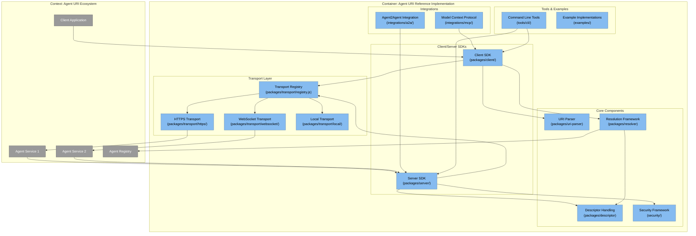
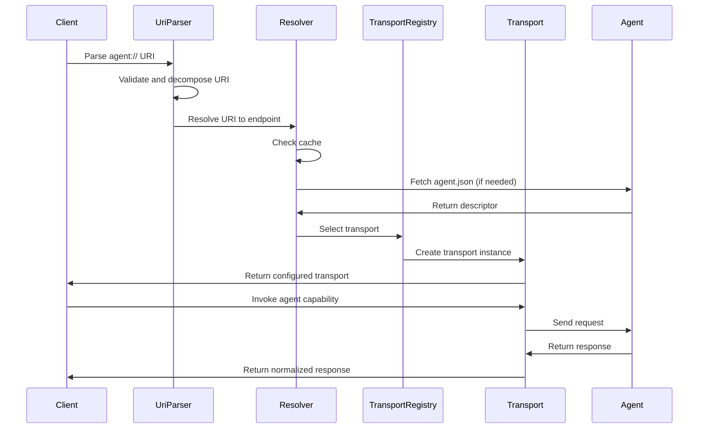
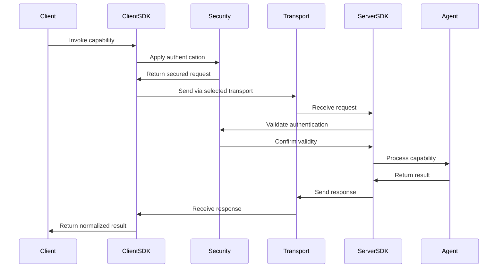

# Agent URI Reference Implementation: Architecture

This document outlines the architecture of the `agent://` protocol reference implementation using the C4 model (Context, Containers, Components, and Code).

## C4 Model Architecture Diagram

## Key Layers

The reference implementation is organized into four key layers:

1. **URI Handling Layer**: Responsible for parsing and manipulating agent:// URIs
2. **Resolution Framework**: Maps agent URIs to concrete endpoints
3. **Transport Bindings**: Implements communication protocols for agent invocation
4. **Capability Framework**: Manages agent descriptors and capabilities

## Detailed Component Breakdown

### 1. Core Components

#### URI Parser (`packages/uri-parser/`)
- **Purpose**: Parse, validate, and manipulate agent:// URIs
- **Key Components**:
  - URI Parser Class: Decomposes URIs into authority, path, query, and fragment
  - URI Builder: Constructs valid agent:// URIs
  - Validation: Ensures URI syntax follows the specification
  - Query Parameter Handling: Parse and sanitize query parameters

#### Descriptor Handler (`packages/descriptor/`)
- **Purpose**: Manage agent descriptors (agent.json)
- **Key Components**:
  - Descriptor Parser: Reads and validates agent.json files
  - Capability Mapper: Extracts and processes capability information
  - Schema Validator: Validates against JSON Schema definitions
  - Version Manager: Handles versioning information

#### Resolution Framework (`packages/resolver/`)
- **Purpose**: Resolve agent:// URIs to concrete endpoints
- **Key Components**:
  - Resolver Interface: Common interface for all resolvers
  - DNS Resolver: Resolves domain-based authorities
  - DID Resolver: Handles decentralized identifiers
  - Well-Known Resolver: Checks /.well-known/agents.json
  - Cache Manager: Caches resolution results

#### Transport Registry (`packages/transport/registry.js`)
- **Purpose**: Central registry for transport bindings
- **Key Components**:
  - Registry Service: Maps transport protocols to implementations
  - Plugin Architecture: Allows registration of custom transports
  - Transport Selection Logic: Chooses appropriate transport based on URI and context

### 2. Transport Implementations

#### HTTPS Transport (`packages/transport/https/`)
- **Purpose**: Implements HTTP/HTTPS-based invocation
- **Key Components**:
  - HTTP Client: Handles GET/POST requests
  - Content Negotiation: Manages Accept and Content-Type headers
  - Authentication Helper: Adds auth tokens to requests
  - Response Handler: Processes HTTP responses and errors

#### WebSocket Transport (`packages/transport/websocket/`)
- **Purpose**: Implements WebSocket-based streaming interactions
- **Key Components**:
  - WebSocket Client: Establishes and maintains connections
  - Message Formatter: Encodes/decodes messages
  - Stream Handler: Manages continuous data streams
  - Reconnection Logic: Handles connection interruptions

#### Local Transport (`packages/transport/local/`)
- **Purpose**: Enables local agent invocation without network
- **Key Components**:
  - IPC Mechanism: Inter-process communication
  - Runtime Registry: Tracks locally available agents
  - Direct Invocation: High-performance local calls

### 3. Client/Server SDKs

#### Client SDK (`packages/client/`)
- **Purpose**: Simplifies agent invocation from applications
- **Key Components**:
  - Agent Client: High-level interface for agent invocation
  - Capability Discovery: Fetches and parses agent capabilities
  - Session Management: Handles stateful interactions
  - Response Processing: Normalizes responses across transports

#### Server SDK (`packages/server/`)
- **Purpose**: Framework for implementing agent:// compatible services
- **Key Components**:
  - Agent Server: Base class for creating agent services
  - Capability Registration: Declares available capabilities
  - Request Handling: Processes incoming invocations
  - Transport Binding: Exposes agent via multiple transports

### 4. Security Implementations

#### Authentication (`security/auth/`)
- **Purpose**: Implement standard authentication methods
- **Key Components**:
  - OAuth2 Client: Bearer token handling
  - API Key Manager: Key-based authentication
  - JWT Processor: Creates and validates JWTs
  - mTLS Helper: Mutual TLS configuration

#### Delegation (`security/delegation/`)
- **Purpose**: Enable secure agent-to-agent delegation
- **Key Components**:
  - Delegation Chain: Tracks multi-agent invocation paths
  - Permission Verifier: Checks delegation permissions
  - Chain Validator: Validates delegation integrity

#### Access Control (`security/access-control/`)
- **Purpose**: Implement capability-based access control
- **Key Components**:
  - Capability Token: Represents granted permissions
  - Access Evaluator: Determines if access is allowed
  - Policy Engine: Applies access control policies

### 5. Integration Components

#### Agent2Agent Integration (`integrations/a2a/`)
- **Purpose**: Interoperate with Google's Agent2Agent protocol
- **Key Components**:
  - AgentCard Adapter: Converts between formats
  - A2A Client: Communicates with A2A-compatible agents
  - Protocol Bridge: Maps between interaction models

#### Model Context Protocol Integration (`integrations/mcp/`)
- **Purpose**: Interoperate with Anthropic's MCP
- **Key Components**:
  - MCP Client: Communicates with MCP services
  - Context Adapter: Maps agent:// concepts to MCP

### 6. Tools and Developer Utilities

#### CLI (`tools/cli/`)
- **Purpose**: Command-line interface for agent:// operations
- **Key Components**:
  - URI Validator: Checks URI syntax
  - Agent Explorer: Discovers and displays agent capabilities
  - Invocation Tool: Tests agent invocations
  - Descriptor Generator: Creates agent.json templates

#### Conformance Test Suite (`tools/conformance/`)
- **Purpose**: Tests agent:// protocol compliance
- **Key Components**:
  - URI Tests: Verify URI handling
  - Transport Tests: Check transport bindings
  - Descriptor Tests: Validate descriptor handling
  - Security Tests: Verify auth mechanisms

## Implementation Strategy

1. **Modular Architecture**: Each package should be independently usable
2. **Progressive Enhancement**: Support minimal implementations first, then add advanced features
3. **Transport Agnostic**: Core logic should work across all transport bindings
4. **Test-Driven Development**: Build comprehensive test coverage for each component
5. **Developer Experience**: Focus on easy-to-use APIs and clear documentation

## Key Flows

### Agent URI Resolution Flow

### Agent Invocation Flow

## Extensibility Patterns

The reference implementation supports several extensibility patterns:

1. **Plugin Architecture**: All major components support plugins for custom behavior
2. **Transport Extensions**: New transport bindings can be registered at runtime
3. **Resolver Extensions**: Custom resolution strategies can be added
4. **Security Extensions**: Authentication and access control are pluggable
5. **Descriptor Extensions**: Support for extended capability metadata

These patterns ensure the implementation can grow to support new use cases while maintaining backward compatibility.
